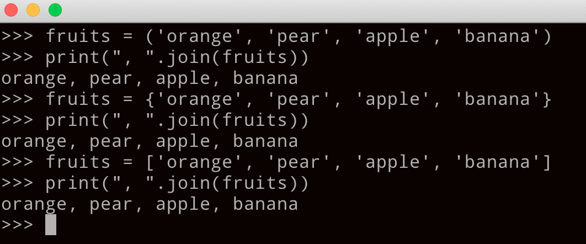
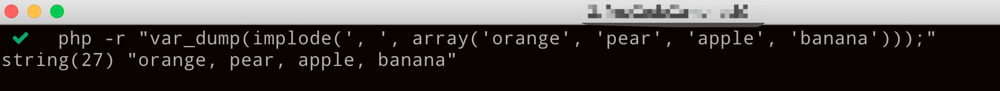

问题一: 将序列中的元素以指定字符分割生成一个新字符串

内置函数 join() 与之对应的是split()
语法格式
   str.join(sequence)
   str: 指定分割的字符
   sequence: 要连接的元素序列

备注: 与php 对应的是 implode() -> explode()

```python
   fruits = ('orange', 'pear', 'apple', 'banana')
   print(", ".join(fruits))
  
   fruits = {'orange', 'pear', 'apple', 'banana'}
   print(", ".join(fruits))

   fruits = ['orange', 'pear', 'apple', 'banana']
   print(", ".join(fruits))
   
```
结果

```php
   <?php
   fruits = array('orange', 'pear', 'apple', 'banana');
   var_dump(implode(', ', fruits));


```
结果

